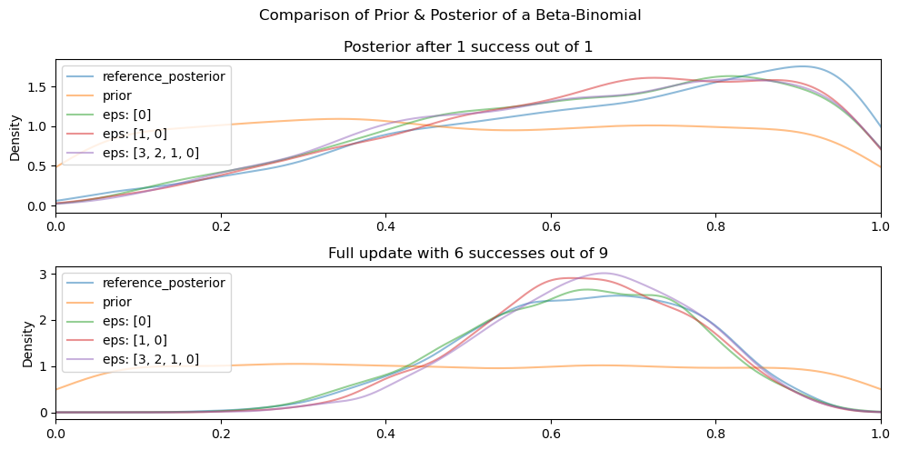

# Unlikely

_Likelihood-free, Parallelized, Bayesian computation_

## Use-cases

Are you interested in inferring the values of some parameters? Do you have
data? Do you have a model that takes into account your idea of the data
generating process? And do you have initial beliefs (priors) that go along with
that? If so, then Unlikely might be for you!

Unlikely works by letting the user specify a `Model`, which encodes:
  1.  their knowledge of the data-generating process through the `simulate`
      function.
  2.  `Prior`s that encode our initial beliefs about the world, before seeing
      the data. These are used to power the simulation.

Through simulation, we sample "particles" from the prior to produce data. If
the data is "close enough" to the data that you observed, then we keep the
particles. We do several iterations of this. In each subsequent iteration, the
notion of "close enough" becomes more stringent, so that the intermediate
distributions get closer and closer to the true posterior distribution.

## Example

Let's say we're interested in figuring out the bias of a coin (maybe it's not
fairly weighted). Let's assume we're uncertain about the coin. We can assign a
flat prior to denote our ignorance.

Let's say we had 9 coin flips, and 6 of them turned out to be heads. What
are probable values of the bias? We can answer this question by computing the
posterior distribution. Because there is a closed-form solution specifically
for the Beta-Binomial distribution, we can use that knowledge to construct a
posterior distribution that can act as the target (reference) distribution.



Below is the code used to generate the data for the first row:

```python
from pathlib import Path

from dask.distributed import Client, LocalCluster
import numpy as np
import pandas as pd
import pytest

from unlikely.engine import abc_smc
from unlikely.models import Models, Model
from unlikely.misc import save_images_from_data
from unlikely.priors import Beta

# A 1 is a "success", and a 0 is a "failure"
obs = np.array([1, 0, 1, 1, 1, 0, 1, 0, 1])

# Number of particles to sample per epoch
num_particles = 2000

# The cutoff(s) that decide whether or not to accept a particle.
epsilons = [3, 2, 1, 0]

def distance(x,y):
    """
    For binomially distributed data, this essentially counts the number of
    "successes". We do that for both the observed and the simulated data sets
    and find the absolute distance between the two of them.

    This is for illustrative purposes only. You could write a more complex
    one that suits your own problem.

    Parameters:
        x: np.array
        y: np.array

    Returns: numeric
    """
    return abs(x.sum() - y.sum())

def simulate(priors):
    """
    Used by a model to simulate data.

    This is for illustrative purposes only. You could write a more complex
    one that suits your own problem.

    Parameters:
        priors: unlikely.priors.Priors
             Acts like a dict. Keys should be names of priors of a model.

    Returns: integer
         A number between 0 and 1.
    """
    return np.random.binomial(n=1, p=priors['beta'], size=1)

# Create a model. A model is a set of priors, plus a simulator
models = Models(
    [
        Model(
            name='flat prior',
            priors=[
                Beta(alpha=1, beta=1, name="beta"),
            ],
            simulate=simulate,
            prior_model_proba=1
        ),
    ],
    perturbation_param=0.9
)

# Compute the posterior distribution.
abc_smc(
    num_particles,
    epsilons,
    models,
    np.array([obs[0]]),
    distance,
)

# The posterior distribution (i.e. accepted particles that are compatible
# "enough" with the data and model) are stored in
# models[0].prev_accepted_proposals
```

To create a posterior distribution for the 2nd row:

```python
# Create a model that uses the full data set
models_more_data = Models(
    [
        Model(
            name='flat prior',
            priors=[
                Beta(alpha=1, beta=1, name="beta"),
            ],
            simulate=simulate,
            prior_model_proba=1
        ),
    ],
)

# Compute the posterior distribution for the models object with all the data.
abc_smc(
    num_particles,
    epsilons=epsilons,
    models=models_more_data,
    obs=obs,
    distance=distance,
)

```

_Optional_. The code used to generate the images above:

```python
# Assuming you have an "images" folder in your current working directory:
save_images_from_data(
    save_path=Path(os.getenv("PWD")) / "images" / "beta_binomial_example.png",
    data={
        'title': "Comparison of Prior & Posterior of a"\
        + " Beta-Binomial Model",
        'data': [
            [
                {
                    'title': 'Posterior after 1 success out of 1',
                    'data': [
                        models[0].prev_accepted_proposals.rename(
                            columns={'beta': 'posterior (eps: [3,2,1,0])'}
                        ),
                        pd.DataFrame(
                            {
                                'reference_posterior': np.random.beta(
                                    2, 1, num_particles)
                            }
                        ),
                        pd.DataFrame(
                            {
                                'prior': np.random.beta(
                                    1, 1, num_particles)
                            }
                        )
                    ]
                },
                {
                    'title': 'Full update with 6 successes out of 9',
                    'data': [
                        models_more_data[0].prev_accepted_proposals.rename(
                            columns={'beta': 'posterior (eps: [3,2,1,0])'}
                        ),
                        pd.DataFrame(
                            {
                                'reference_posterior': np.random.beta(
                                    obs.sum() + 1,
                                    len(obs) - obs.sum() + 1,
                                    num_particles
                                )
                            }
                        ),
                        pd.DataFrame(
                            {
                                'prior': np.random.beta(
                                    1, 1, num_particles)
                            }
                        )
                    ]
                }
            ]
        ]
    },
    xlim=(0, 1),
    figsize_mult=(5, 5)
)
```

## Installation

```
conda install unlikely -c edderic
```

## References


[Tutorial on ABC rejection and ABC SMC for parameter estimation and model selection](https://arxiv.org/abs/0910.4472)

[Approximate Bayesian computation scheme for parameter inference and model selection in dynamical systems.  Tina Toni, David Welch, Natalja Strelkowa, Andreas Ipsen, Michael P.H. Stumpf](https://arxiv.org/abs/0901.1925)

[Stack Exchange: How Do I Calculate the Weights in ABC-SMC](https://stats.stackexchange.com/questions/326071/how-do-i-calculate-the-weights-in-abc-smc)

[pyABC](https://github.com/ICB-DCM/pyABC)
